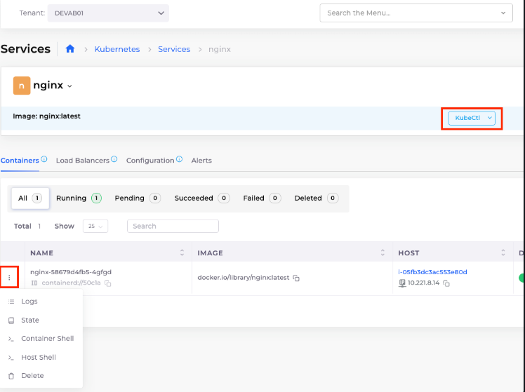

# 1. Host, container, and kubectl shell

Navigate to **Kubernetes ->** **Services** -> \[_select_ `nginx` _service_].

In the **Containers** tab, click the **Actions** icon (  ) next to the `nginx`container and select **Container Shel**l or **Host Shell**.

Additionally, you can access a `kubectl`shell scoped to this Tenant's Kubernetes Namespace by clicking the **Kubectl** button.

<figure><figcaption>
<code>nginx</code>Services page with options for <strong>Container Shell</strong> and <strong>Host Shell</strong> displayed
</figcaption></figure>

