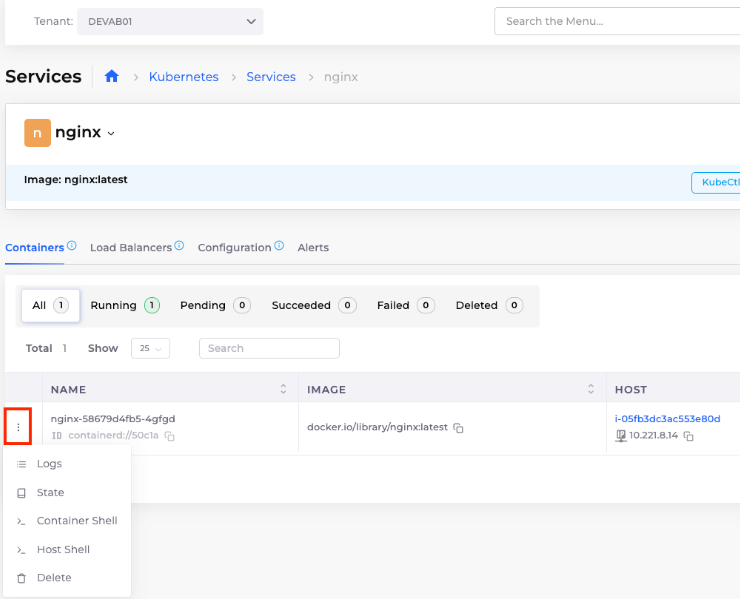
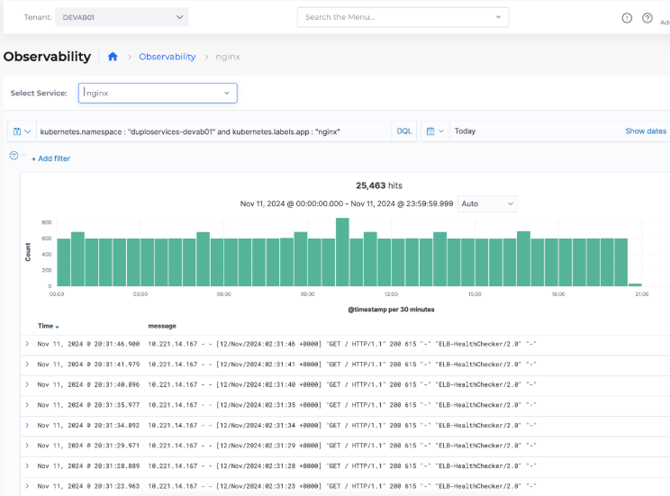

# 2. Logging

## View container logs

Navigate to **Kubernetes -> Services ->** \[_select_ `nginx` _service_]

In the **Containers** tab, click the **Actions** icon (  ) next to the `nginx`container and select **Logs**.

<figure><figcaption>
<strong>Containers</strong> tab for <code>nginx</code>Service with <strong>Logs</strong> option displayed
</figcaption></figure>

## Enable Log Collection for Tenant

Navigate to **Administrator  ->** **Observability  ->** **Standard** -> **Settings** -> **Logging** ta&#x62;**.** Select the Tenant for which you want to enable logging and click **Update**.

## View Logging with OpenSearch

Navigate to **Observability** > **Standard** > **Logging.**

Logs are segregated by Tenant and then by Service.

<figure><figcaption>
Logging for <code>nginx</code>service on the <strong>Observability</strong> page
</figcaption></figure>
