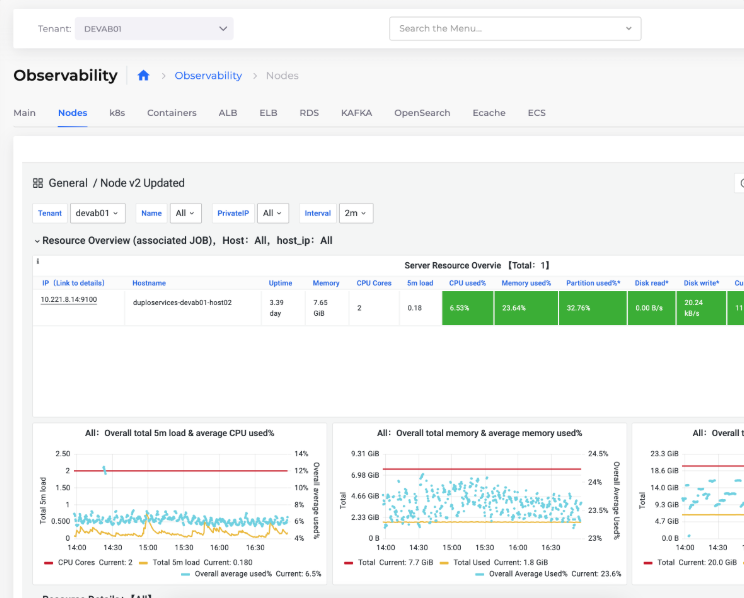

# 3. Metrics

## Enable Metric Collection for Tenants&#x20;

Navigate to **Administrator -> Observability -> Basic -> Settings -> Monitoring** Tab.

Select the Tenant for which you want to enable metrics and click **Update**.

## Viewing Metrics

Navigate to **Observability -> Basic -> Metrics**.

<figure><figcaption>
Metrics for <strong>Nodes</strong>
</figcaption></figure>
