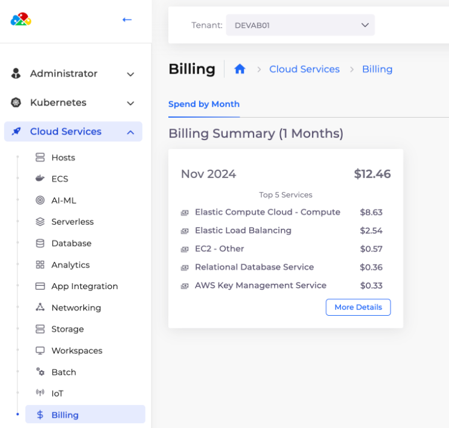
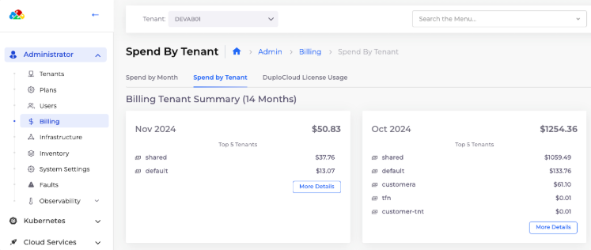

# 4. Billing and Cost Management

Navigate to **Administrator -> Billing** to view billing across your AWS account.

<figure><figcaption>
Billing <strong>Spend by Month</strong>
</figcaption></figure>

Navigate to **Cloud Services -> Billing** to view the cost per Tenant.&#x20;


Tenant billing reports populate within 24 hours of Tenant creation.


<figure><figcaption>
<strong>Billing Tenant Summary</strong> 
</figcaption></figure>
