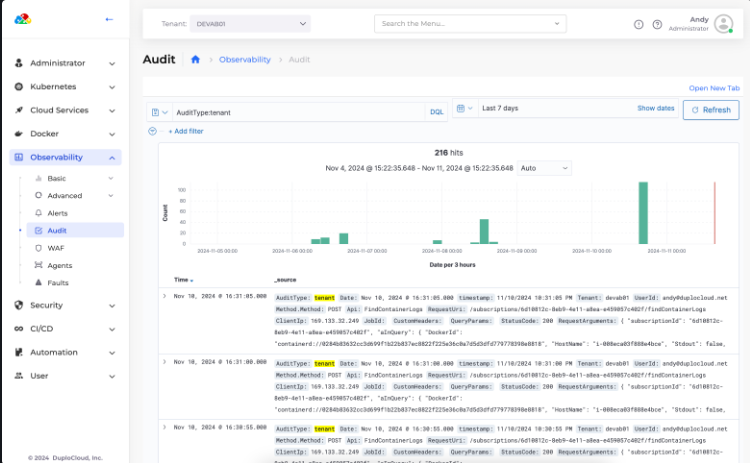
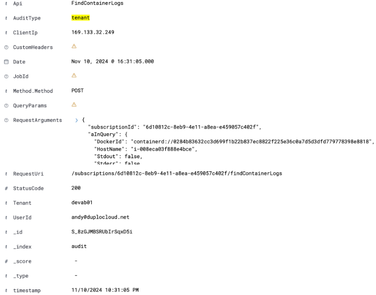

# 5. Audit Logs

Navigate to **Observability -> Audit**. The **Audit** page displays.

<figure><figcaption>
The <strong>Audit</strong> page
</figcaption></figure>

Here is an example of the details of an audit event.

<figure><figcaption>
<strong>Audit</strong> event details
</figcaption></figure>

