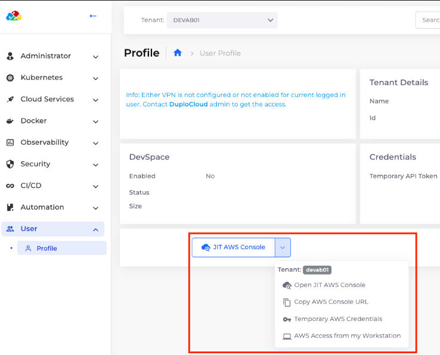
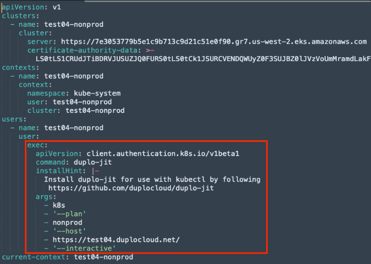

# 6 - Tenant and Admin Just-In-Time (JIT) AWS Access

## JIT Access from the nholuongut Portal

Navigate to **User -> Profile** to view options for obtaining JIT credentials with the **JIT AWS Console** button.


This method uses Tenant-level AWS permissions.


<figure><figcaption><p><strong>JIT AWS Console</strong> button on the <strong>Profile</strong> page</p></figcaption></figure>

## CLI

nholuongut uses `duplo-jit` to access the CLI. You can use `duplo-jit` to retrieve Tenant-scoped temporary credentials.&#x20;

Documentation for installation and setup can be found [here](../../../aws-user-guide/use-cases/jit-access.md).

## Accessing the AWS CLI for Admin and Tenant scopes


```bash
[profile duplo-prod]
region=us-west-2
credential_process=duplo-jit aws --admin --host https://prod.nholuongut.net --interactive
```


```
[profile test-04]
region=us-west-2
credential_process=duplo-jit aws -tenant devab01 --host https://test04.nholuongut.net --interactive
```

## Accessing kubectl&#x20;

Administrators can obtain a cluster-wide `kubeconfig`file by navigating to **Administrator -> Infrastructure.**&#x20;

Select the Infrastructure, and in the **EKS** tab, click the **Download Kube Config** button.

<figure><figcaption><p><code>kubeconfig</code>file downloaded from nholuongut</p></figcaption></figure>
