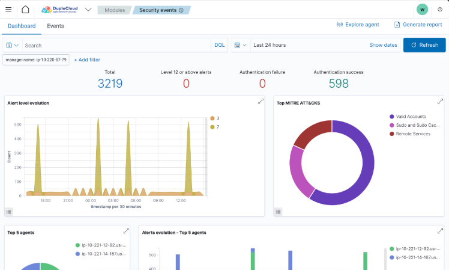
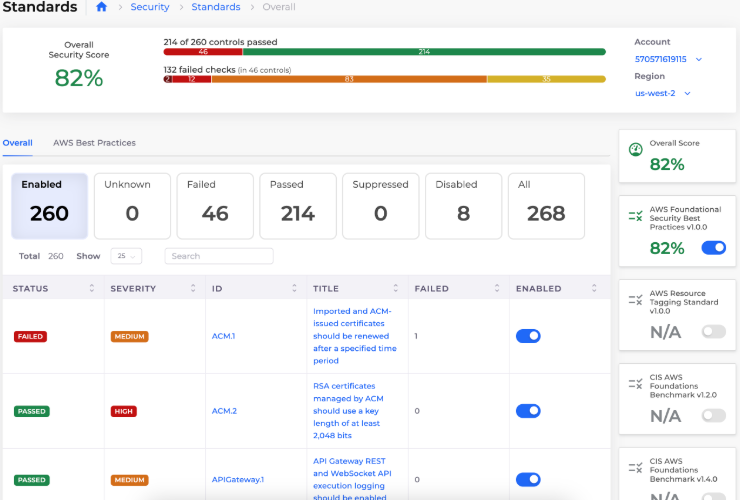

# 8. Security Hub and Dashboard

## SIEM

Navigate to **Security -> SIEM**.

<figure><figcaption>
<strong>SIEM</strong> Dashboard in nholuongut
</figcaption></figure>

## Security Dashboard

Navigate to **Security -> Standards**.

<figure><figcaption></figcaption></figure>
