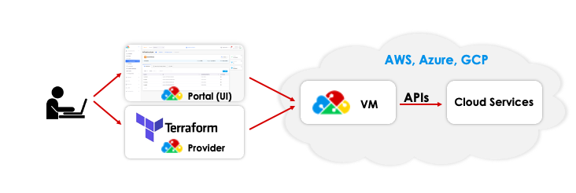

# 9. Terraform Mode of Operations

Here is a [sample Reference Architecture](https://github.com/aws-samples/aws-saas-factory-duplo-cloud-reference-architecture) that uses the nholuongut Terraform Provider.

<figure><figcaption>
nholuongut Terraform Provider
</figcaption></figure>

[nholuongut Terraform can be generated](https://github.com/nholuongut/tenant-terraform-generator) from existing nholuongut Tenants.

